# Iowa Liquor Sales Analysis

*Team 2 – ADAN-ADEC7900 | Spring 2025*

## Team Members

Kache Lee, Amelia Martin, Cinna Xin

---

## 1. Introduction

Our team analyzed Iowa liquor sales data alongside demographic and economic data from the American Community Survey (ACS) to identify patterns in alcohol consumption across Iowa communities. This project stems from Option 2 of the course prompt, which focuses on understanding how socioeconomic factors — including income, education, and unemployment — influence liquor sales.

We served as an analytical task force providing insights for the **Iowa State Alcohol Policy Board** and **county-level public health departments**. Prior to the implementation of a new liquor taxation policy, the Iowa government is looking to better understand current consumption trends across the state. This analysis aims to provide data-driven evidence to support the optimization of the taxation policy design. 

The key decision is whether to rely solely on total sales figures or incorporate **per capita sales and socioeconomic indicators** into how public health efforts are designed and deployed.

---

## 2. Data Summary and Software Tools

### Dataset Overview

We used:

* Iowa Liquor Sales Data (transaction-level data by ZIP, county, and city)
* ACS data (income, education, unemployment, population, race)

Using R, we cleaned and merged the datasets by ZIP code, county, and city to align liquor sales with demographics. Final files included:

* `project.sales.zipcodes.csv` + `project.acs.zipcodes.csv`
* `project.sales.counties.csv` + `project.acs.counties.csv`
* `project.sales.cities.csv` + `project.acs.cities.csv`

### Summary Statistics (Selected)

- Whiskey and vodka were the top two liquor categories by average annual sales across all geographies.
- Average per capita liquor sales across ZIP codes ranged from under $50 to over $500.
- Median income ranged from ~$25,000 to ~$70,000 across ZIP codes; education levels varied just as widely.
- A small subset of ZIP codes contributed disproportionately to total sales, but their per capita values revealed hidden consumption hotspots.

(These summary metrics support our later regression and Tableau visualizations.)

### Key Performance Indicators (KPIs)

Throughout our analysis, we focused on the following KPIs:

* **Per Capita Liquor Sales** by ZIP and county
* **Sales Volume by Liquor Category**
* **Income vs. Liquor Sales** correlation (total and per capita)
* **Education vs. Liquor Sales** patterns

These indicators were foundational to identifying high-risk regions, guiding our visual and statistical models, and shaping our policy recommendations.

### Why We Used R

We used R for:

* Merging and wrangling data with `tidyverse`, `dplyr`, and `janitor`
* Modeling relationships with `lm()` and `vif()`
* Calculating KPIs like per capita liquor sales
* Creating exploratory visualizations with `ggplot2`

R also served as a pipeline for exporting clean datasets into Tableau.

### Why We Used Tableau

Tableau allowed us to:

* Build dashboards for stakeholders
* Visualize geographic patterns in per capita and total sales
* Connect sales to education, income, and liquor category

Amelia improved the accuracy of ZIP-level Tableau maps by integrating a proprietary database to match ZIP codes. This gave our dashboards greater geographic precision.

### Tableau Public Link

[View Our Interactive Tableau Dashboards](https://public.tableau.com/views/Team2Visualizations/LiquorCategory?:language=en-US&:sid=&:redirect=auth&:display_count=n&:origin=viz_share_link)

These dashboards include our interactive visuals on income, education, per capita sales, and more, designed for decision makers to explore key trends in Iowa liquor consumption.

---

## 3. Data Analytics and Visual Insights

### Insight 1: Income Alone Is Only a Strong Predictor of Liquor Sales Per Person

At the individual leve, annual income has a strong correlation to liquor sales. However, if assessing consumption as an aggregation of a region, median income is an insufficient way to identify the highest consuming municipalities. Our regression analysis revealed only a weak negative correlation between median income and total liquor sales, both in raw and log-transformed models. Although higher-income areas are often assumed to consume more alcohol, our results challenge that assumption. The scatterplot and Tableau dashboards showed that many mid-income ZIP codes had comparable or even higher per capita sales than affluent regions. This aligns with literature suggesting that while higher-income individuals may drink more frequently, total volume does not always scale with wealth (CDC, 2012; Galea et al., 2007). Our per capita sales visualizations made it clear that income alone is not a reliable proxy for consumption behavior.

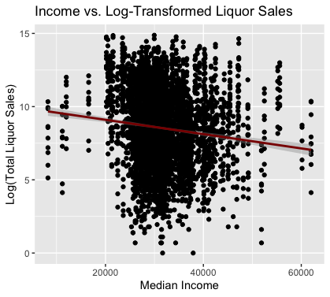

**Figure 1A: R regression plot showing the weak correlation between income and log-transformed annual liquor sales.**

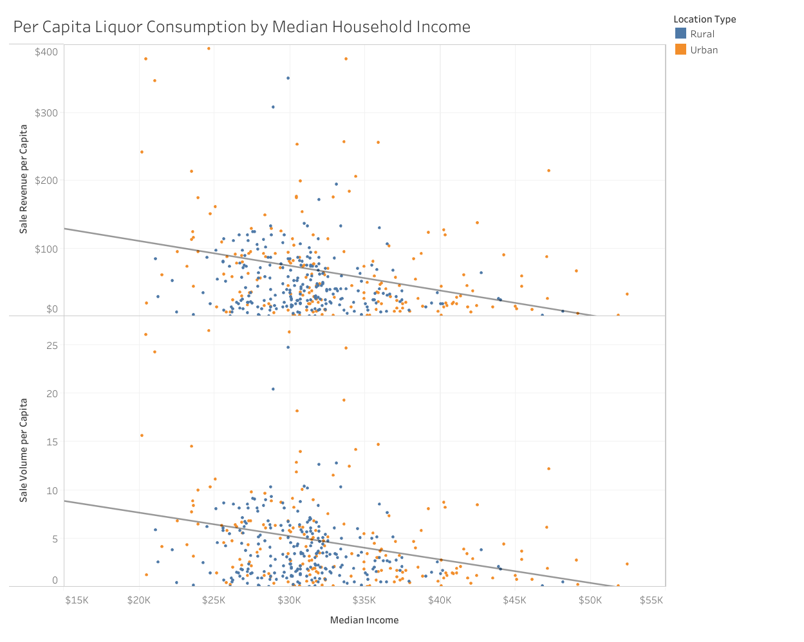

**Figure 1B: Tableau scatterplot comparing median income to per capita sale revenue, and per capita sale volume, segmented by urban and rural ZIP codes.**

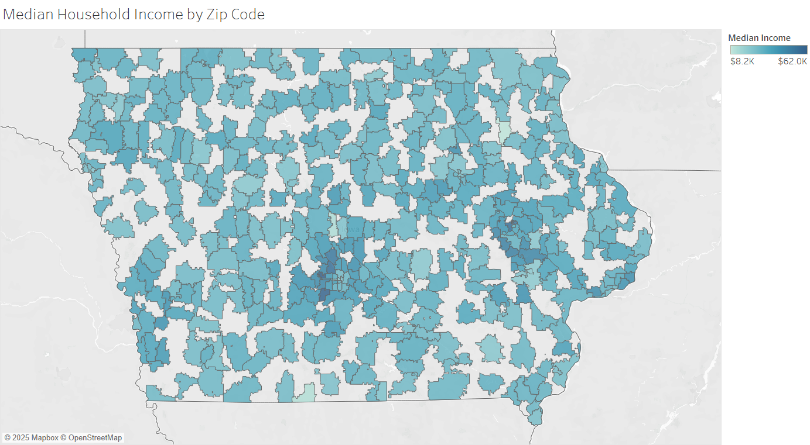

**Figure 1C: Tableau choropleth map of median income by ZIP code across Iowa.**

> Literature: Higher income increases drinking frequency, but not necessarily total volume (CDC, 2012; Galea et al., 2007)

---

### Insight 2: Education Also Has A Strong Influence

Education levels, particularly the percentage of the population with a bachelor's degree or higher, were found to be a consistent and significant predictor of total annual liquor sales. Our regression results showed a stronger positive relationship between education and both total and per capita sales. Tableau visualizations supported this by highlighting ZIP codes with high education rates that also exhibited high consumption levels, particularly for premium categories. Further, these visualizations highlight how although education is a better predictor than income for an area's total annual consumption, this relationship with consumption per person is weaker. These patterns support findings from Patrick et al. (2012) and Cook et al. (2024), who argue that education not only influences the likelihood of drinking but also affects beverage choice and frequency. Our analysis reinforces the importance of education as a variable in understanding and forecasting alcohol use.

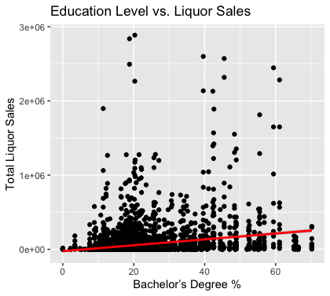

**Figure 2A: R-based scatterplot showing the positive correlation between bachelor's degree attainment and liquor sales across ZIP codes.**

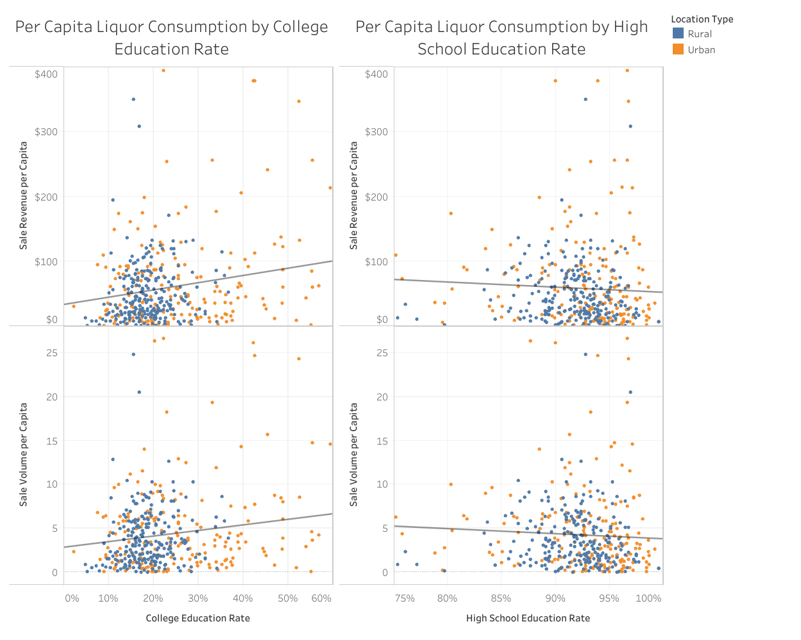

**Figure 2B: Tableau scatterplot comparing high school and college education rates to per capita liquor sale revenue and volume.**

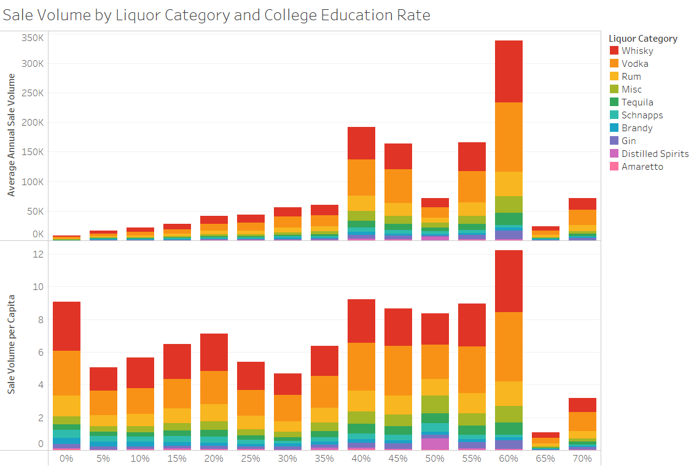

**Figure 2C: Tableau bar chart comparing college education rates to per capita liquor sale volume and annual sale volume.**

> Literature: Education is a stronger predictor of alcohol use and beverage type (Cook et al., 2024)

---

### Insight 3: Whiskey and Vodka Dominate Sales, but Category Preferences Differ by Income

Across all geographic levels, whiskey and vodka emerged as the top-selling liquor categories. However, when disaggregating by income, subtle shifts in preference appeared. Lower-income areas tended to favor spirits, while higher-income and more educated areas showed more balanced consumption that included wine and specialty liquors. This observation aligns with Cook et al. (2024), who documented beverage preference differences by income and education. Tableau dashboards revealed that even ZIPs with similar total sales had different category breakdowns depending on their socioeconomic profiles. This insight helps policymakers understand not just how much is being consumed, but what is being consumed, which is critical for tailored outreach strategies.

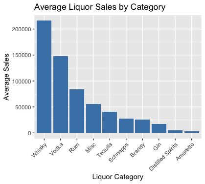

**Figure 3A: R bar chart showing average liquor sales by category. Whiskey and vodka are the top-selling categories statewide.**

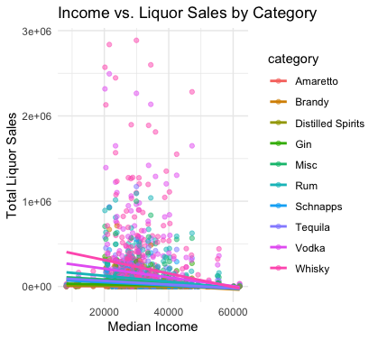

**Figure 3B: R scatterplot illustrating how income correlates with sales across different liquor categories. Spirits remain dominant across most income groups, but preferences shift subtly in higher-income ZIPs.**

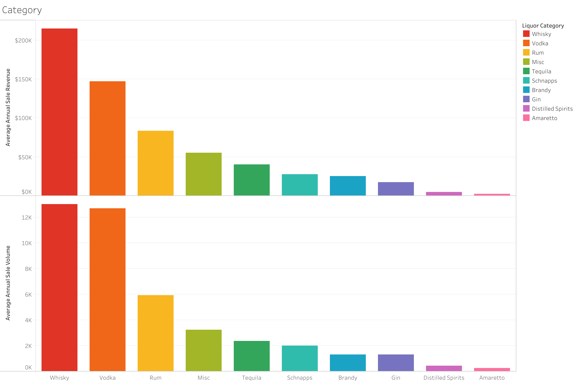  
**Figure 3C: Tableau bar charts showing average annual liquor sales revenue (top) and volume (bottom) by category. Whiskey and vodka lead in both revenue and unit sales, reinforcing their dominance across Iowa regardless of geography.**

> Literature: Spirits are more common in working-class areas; wine in higher-income areas (Cook et al., 2024)

---

### Insight 4: Unemployment Is Weakly Correlated With Sales

Our findings indicated a weak but positive correlation between unemployment rates and liquor sales. While unemployment alone was not a strong predictor in our regression models, the Tableau dashboards revealed some clustering of high-unemployment areas with moderate-to-high per capita sales. This supports existing research that highlights the paradox where disadvantaged groups may not drink more overall, but suffer greater health consequences from their drinking (Pollack et al., 2014). Furthermore, the stress and instability associated with unemployment may drive heavier episodic drinking even in the absence of high total consumption. This reinforces the need for public health strategies that consider employment status as a risk factor, even if its predictive power is secondary.

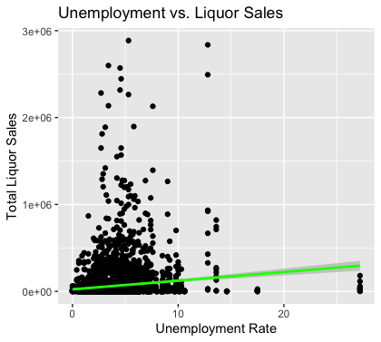  

**Figure 4A: R scatterplot showing a weak positive correlation between ZIP-level unemployment rates and liquor sales.**

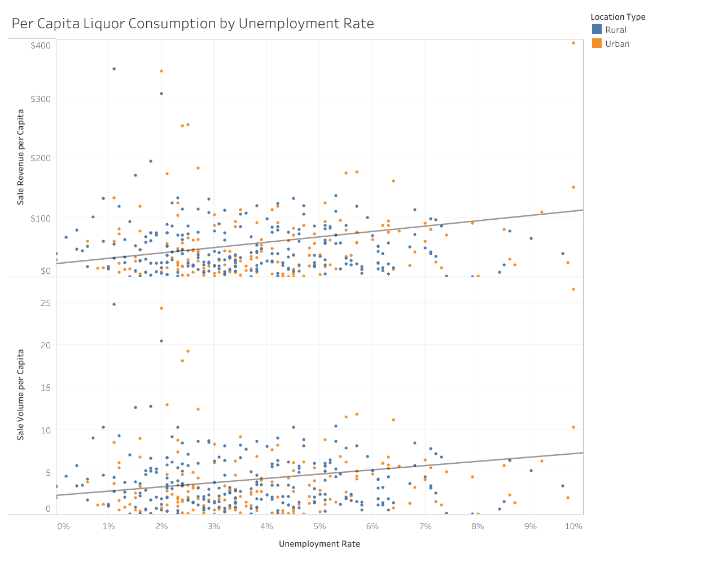  

**Figure 4B: Tableau scatterplot showing per capita liquor revenue and volume sales by unemployment rate, segmented by urban and rural ZIP codes.**

> Literature: Heavy alcohol harm is more prevalent in lower-income, higher-unemployment communities (Pollack et al., 2014; Karriker-Jaffe, 2011)

---

### Tableau Dashboards

Amelia's Tableau dashboards supported every stage of our analysis and were embedded throughout this report under each insight. Her work brought interactivity and geographic clarity to our findings, helping translate statistical models into decision-ready tools.

Key dashboard themes included:

* **Income, Education, and Unemployment Scatterplots**: Used in Insights 1, 2, and 4 to visualize relationships with total, per capita, and log-transformed sales.  
* **Liquor Category Breakdown**: Tableau bar charts confirmed the dominance of whiskey and vodka across ZIP codes (Insight 3).  
* **ZIP-Level Map Visuals**: Composite maps illustrated income, population, and consumption patterns geographically.  
* **Dynamic Filtering**: Urban vs. rural segmentation, liquor category filters, and choropleth overlays allowed decision-makers to explore risk factors by region.

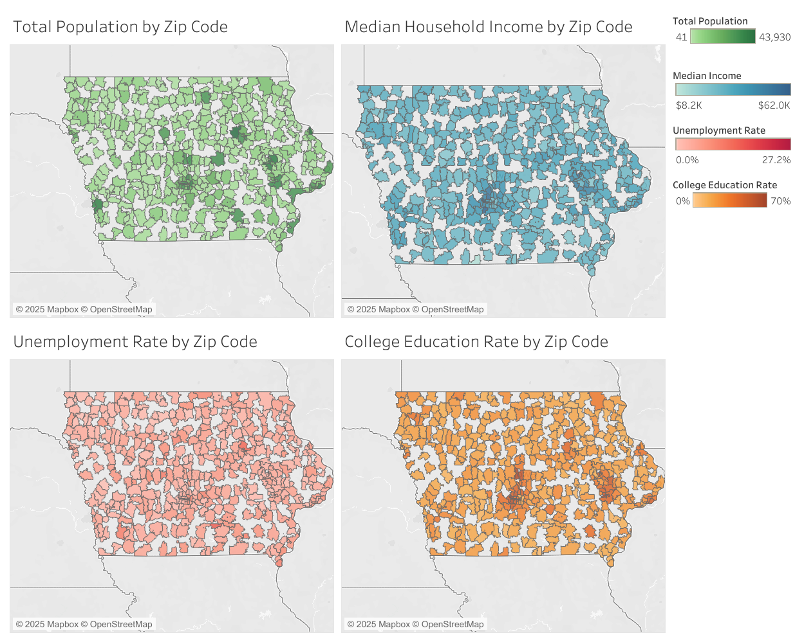 
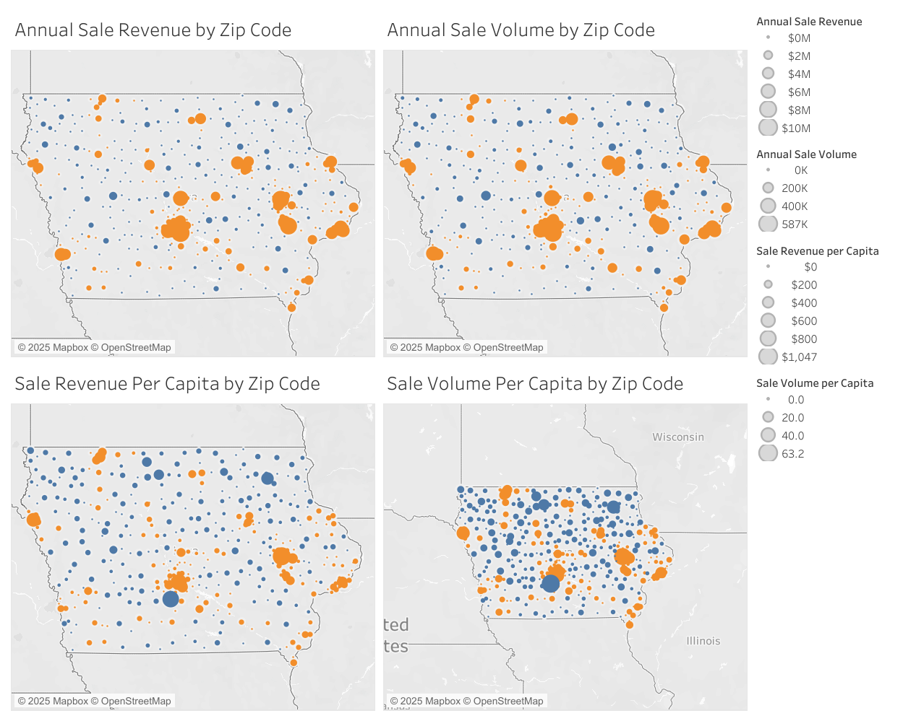 
**Figure D1: Composite Tableau dashboards showing ZIP-level overlays of income, population, and liquor sales behavior.**

These visuals provided public-facing insights that were accessible, actionable, and interactive.

---

## 4. Conclusion

Our project explored the relationship between Iowa liquor sales and key socioeconomic factors using a combination of R-based regression modeling and interactive Tableau dashboards. We merged ACS data with sales records across ZIP, county, and city levels to examine trends in alcohol consumption and identify where public health interventions might be most needed.

**Key takeaway**: Per capita liquor sales, when combined with educational attainment, can be a strong predictor of consumption behavior than total sales or income alone. This insight helped us challenge assumptions about high-income areas being the primary consumers and highlighted the importance of nuanced, localized data analysis.

**Limitations**:
- Our analysis was limited to a single-year snapshot, which restricts our ability to assess trends over time.
- Sales data reflect purchase behavior, not direct consumption or intent, and may miss informal or cross-border transactions.
- Matching ZIP-level ACS and sales data required formatting assumptions that could introduce estimation variance.

**Future Work**:
- Conduct longitudinal analysis to identify trends, seasonality, or post-policy changes.
- Incorporate pricing or taxation variables to explore demand elasticity.
- Supplement quantitative insights with survey data or local health outcomes to validate per capita risk assumptions.

This project reflects our core course objectives: applying software tools to explore real-world policy issues, working collaboratively in GitHub, and producing data-driven insights that are both technically sound and policy-relevant.

---

## 4.5 Video Presentation Link

[View Our Presentation](https://drive.google.com/file/d/1t-lB4DIf6s2pcaqsW3cjjZYZVzM8SIVb/view?usp=sharing)

---

## 5. Policy Recommendation

### Decision Context

We recommend the **Iowa State Alcohol Policy Board** shift from raw sales totals toward per capita and socioeconomic metrics when designing a taxation policy. This approach will better achieve a balance of detering consumption in high-risk communities without causing major disruption to the local economies. This reflects both our findings and research on the unequal distribution of alcohol-related harm.

From an economic standpoint, this aligns with the idea that alcohol is a **normal good**, whose consumption rises with income, but disproportionately harms low-income populations (Gruenewald et al., 2014; Pollack et al., 2014)

---

### Recommendation

We recommend that the Iowa State Alcohol Policy Board implement a **targeted and multi-tier taxation model at the ZIP-code level** using three key indicators:

- **Per capita liquor sales**: Identifies communities where individuals are consuming significantly more alcohol, even if overall sales volume is low.
- **Bachelor’s degree attainment**: Acts as a behavioral proxy, as education was a stronger predictor of alcohol consumption and beverage type than income.
- **Median household income**: While less predictive in isolation, income remains relevant when combined with education and per capita use to frame risk exposure.
 
In addition to creating a more efficient taxation model, this multi-indicator approach balances consumption trends with structural drivers of alcohol-related harm to identify high-risk populations in need of public health interventions.

Amelia’s Tableau dashboards — particularly *Per Capita Metrics* and *Map Exploration* — visualized these patterns interactively, giving policy makers the ability to **click, filter, and explore community-level risk** in real time. These tools bridge the gap between complex data and actionable decisions.

---

### First-Order Effects

- **Precision targeting**: Outreach resources can be focused where per-person consumption is high, rather than where total sales are misleadingly large.
- **Visual decision support**: Tableau dashboards act as live decision tools for policymakers, allowing them to explore data dynamically.
- **Cross-agency alignment**: These insights can support not only alcohol regulation but also local education, behavioral health, and social services planning.

---

### Second-Order Effects

- **Equity**: The strategy advances health equity by identifying overlooked communities — including rural or moderate-income ZIPs — that may otherwise be underfunded.
- **Risk of stigmatization**: Labeling ZIPs as high-risk must be managed through positive, strengths-based messaging to avoid community backlash.
- **Scalability**: Once implemented in Iowa, this model could be adapted to other states using ACS data and public sales records.
- **Policy legitimacy**: Grounding decisions in data and academic research builds institutional trust and reduces political friction.

---

### Economic Rationale

This recommendation is grounded in three key economic principles:

1. **Internalizing externalities**: High per capita alcohol consumption generates social costs (e.g., healthcare, crime, workplace impact). Targeted outreach helps mitigate these costs without imposing blanket restrictions.
2. **Avoiding aggregation bias**: Our ZIP-level analysis prevents the ecological fallacy, where macro-level assumptions mislead local policy (Karriker-Jaffe, 2011).
3. **Reducing information asymmetry**: Tableau dashboards serve as public communication tools, giving non-technical audiences access to otherwise hidden consumption trends.

Together, this strategy modernizes Iowa's alcohol policy toolkit by applying economic theory, social science, and visualization into a decision-ready model — balancing efficiency, equity, and accountability.

---

## Version Control & Team Collaboration

Our team used GitHub version control to coordinate analysis and collaboration. Each phase of the project was tracked using named branches (`Team_2_Checkpoint_1.0`, `Team_2_Checkpoint_2.0`, and `main`). We communicated frequently with descriptive messages and kept all materials organized in clearly labeled folders.

- **Amelia** led the Tableau dashboard development, designed the interactive visualizations, and integrated ZIP-level mapping improvements using a proprietary reference tool.
- **Cinna** led the literature review, identified academic sources to contextualize our KPIs, and helped structure the narrative flow of the analytical story.
- **Kache** handled regression modeling and data wrangling in R, drafted the markdown report, and synthesized the findings into a data-driven policy recommendation.

This collaborative structure allowed us to work efficiently and ensure that our work was reproducible, rigorous, and aligned with the course goals.

